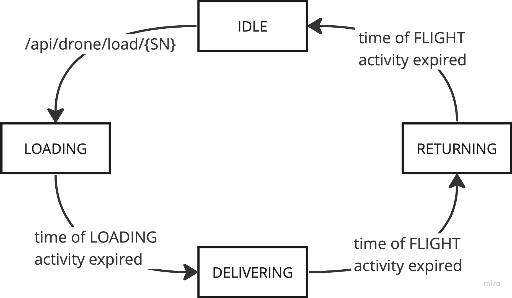

# Drones

## Usage

### Requirements
- Java 11+
- Gradle
- Docker & docker-compose

### Run

Just run the following at the root folder
```bash
./gradlew clean build && docker-compose up -d
```

### API

To study available API you need to follow the [link](http://localhost:8080/api.html) after
docker-compose containers started up. The following are examples
of cURL requests:

```bash
curl --location --request PUT 'http://localhost:8080/api/drone/register' \
--header 'Content-Type: application/json' \
--data-raw '{
    "droneSerialNumber": "TEST1",
    "weightLimit": 100.0,
    "droneModel": "Lightweight"
}'
```

```bash
curl --location --request GET 'http://localhost:8080/api/drone/check/available'
```

```bash
curl --location --request PUT 'http://localhost:8080/api/drone/load/J' \
--header 'Content-Type: application/json' \
--data-raw '[
    {
        "medicationCode": "AFJFSVAYUSOWYZHNS",
        "count": 1
    }
]'
```
to get actual medication code needs to call corresponding API

### Monitoring

To get drone battery capacity monitoring data follow the 
[link](http://localhost:9090) and type `drone_battery` in search 
input, select _Graph_ or _Console_ to get data in various forms

## Assumptions

### Database

#### Database access mechanics

- I use relational database because we need to keep relation 
between entities. In this project for example it is PostgreSQL
- I use JPA with its annotation and repos to simplify querying 
and mappings. All relations and mapping may be done by hands to
speed up and simplify and clarify application and code if it is 
needed.

#### Database schema

- **Drone**
- **Medication**
- **DroneMedication** (many-to-many relationship with additional 
field _count_, that is why it is separate @Entity)
- **Image** (I use separate table (a.k.a @Entity) to reduce amount 
of data that fetching from DB)

#### Database migrations

- I use Flyway as one of possible instruments for database migrations
- Insertions of test data are implemented as migration too. But test 
data is not dictionary data like enums, so it is more convenient to 
insert test data via for example Bash scripts.


### Stub service

- For demonstrating approach I implement stub service. It uses next 
finite-state machine to simulate drones`s activity like loading, 
delivering and returning. Moreover, the service updates battery 
capacities of drones.
- Of course, it will be better to create separate gradle module and
container. But it will be harder to update data in main DB. Let`s 
close our eyes to this.
- For the same reason, I use the same DB for stub service data such as
**Activity**: *FLIGHT* or *LOADING*.



### Metrics service

- For metrics collection I use Prometheus as time-series DB
- It is configured to get metrics for main application including 
my custom metrics **drone_battery**


## Original task

### Introduction

There is a major new technology that is destined to be a 
disruptive force in the field of transportation: **the drone**.
Just as the mobile phone allowed developing countries to 
leapfrog older technologies for personal communication, the 
drone has the potential to leapfrog traditional transportation
infrastructure.

Useful drone functions include delivery of small items that are
(urgently) needed in locations with difficult access.

---

### Task description

We have a fleet of **10 drones**. A drone is capable of carrying 
devices, other than cameras, and capable of delivering small 
loads. For our use case **the load is medications**.

A **Drone** has:
- serial number (100 characters max);
- model (Lightweight, Middleweight, Cruiserweight, Heavyweight);
- weight limit (500gr max);
- battery capacity (percentage);
- state (IDLE, LOADING, LOADED, DELIVERING, DELIVERED, RETURNING).

Each **Medication** has: 
- name (allowed only letters, numbers, ‘-‘, ‘_’);
- weight;
- code (allowed only upper case letters, underscore and numbers);
- image (picture of the medication case).

Develop a service via REST API that allows clients to communicate
with the drones (i.e. **dispatch controller**). The specific 
communicaiton with the drone is outside the scope of this task. 

The service should allow:
- registering a drone;
- loading a drone with medication items;
- checking loaded medication items for a given drone; 
- checking available drones for loading;
- check drone battery level for a given drone;

> Feel free to make assumptions for the design approach. 

---

### Requirements

While implementing your solution **please take care of the 
following requirements**: 

#### Functional requirements

- There is no need for UI;
- Prevent the drone from being loaded with more weight that it 
can carry;
- Prevent the drone from being in LOADING state if the battery 
level is **below 25%**;
- Introduce a periodic task to check drones battery levels and 
create history/audit event log for this.

---

#### Non-functional requirements

- Input/output data must be in JSON format;
- Your project must be buildable and runnable;
- Your project must have a README file with build/run/test 
instructions (use DB that can be run locally, e.g. in-memory, 
via container);
- Required data must be preloaded in the database.
- JUnit tests are optional but advisable (if you have time);
- Advice: Show us how you work through your commit history.
